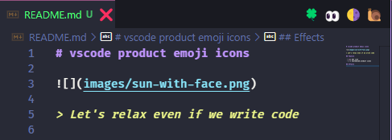

# vscode product emoji icons


> Let's relax even if we write code

## Install

```bash
vsce package
```

## Feature  

 - [x] Set icon  
 - [ ] Customized product icons
 - [ ] Product icon description

## Effects



